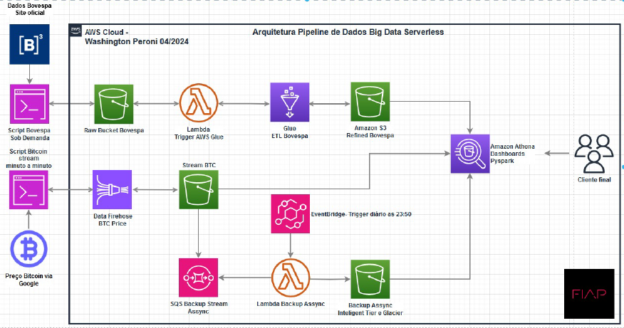

## Tech Challenge #2 **🧩**

🎯 Esse projeto foi desenvolvido com o objetivo de resolver um desafio de pós gradução do curso de Engenharia de Machine Learning da FIAP.

A tarefa é criar uma pipeline de ETL de dados, conforme fluxo mostrado abaixo:



No primeiro fluxo temos a ingestão de dados feita em batch (sob demanda), a ideia é rodar um script localmente que irá carregar os dados no bucket, o evento gerado pelo bucket irá trigar o job do glue, o job do glue irá realizar o etl dos dados salvando novamente no bucket, por fim esses dados serão disponibilizados em um dashboard do athena.

O segundo fluxo tem a mesma ideia, porém agora os dados são ingestados minuto a minuto. Por isso, são adicionados dois componentes nesse workflow, o priemiro é o data firehose que vai receber os dados e disponibilizar no bucket, depois temos o SQS, serviço de fila que vai coordenar os eventos e acionar a função lambda para realizar o ETL dos dados.

### **Tecnologias utilizadas 💡**

---

O projeto foi todo desenvolvido em python, utilizamos as bibliotecas [Beautiful Soup 4](https://beautiful-soup-4.readthedocs.io/en/latest/) e [Selenium](https://www.selenium.dev/pt-br/documentation/webdriver/getting_started/) para a parte de coleta dos dados da ibovespa, utilizamos o provedor de cloud AWS para a criação dos serviços mostrados no fluxo anterior.

### Estrutura de pastas **📂**

---

```
.
└── tech_challenge2/
    ├── aws-resources
    ├── data-pipeline-app-src
    |  ├── custom-bucket-s3
    |  ├── raw-data-b3custom
    |  └── main.py
    └── requirements.txt
```

* **aws-resources:** código de recursos utilizados na aws.
* **custom-bucket-s3:** função que acessa o bucket e faz a manipulação dos objetos.
* **raw-data-b3-custom** código que realiza o webscraping da página do ibovespa e salva o dado em parquet.
* **main.py:** arquivo principal que sobe o arquivo no bucket da amazon.
* **requirements.txt:** arquivo com todos os pacotes necessários para rodar este projeto.

### Início rápido 🚀

---

1. Abra o terminal dentro do diretório do projeto.

2. Instale as dependências do projeto, aqui o ideal é ter um ambiente virtual já criado.

   `pip install -r requirements.txt`
3. Rode o comando abaixo para subir o arquivo no bucket

   `python data-pipeline-app/src/main.py`

**Obs.:** É importante ter o bucket configurado na AWS, assim como os outros serviços mostrados no diagrama para conseguir rodar o projeto ponta a ponta.

### Demos ⚒️

---

Clique [aqui](colocar link do drive) e assita a demo do primeiro fluxo, com ingestão dos dados sob demanda
